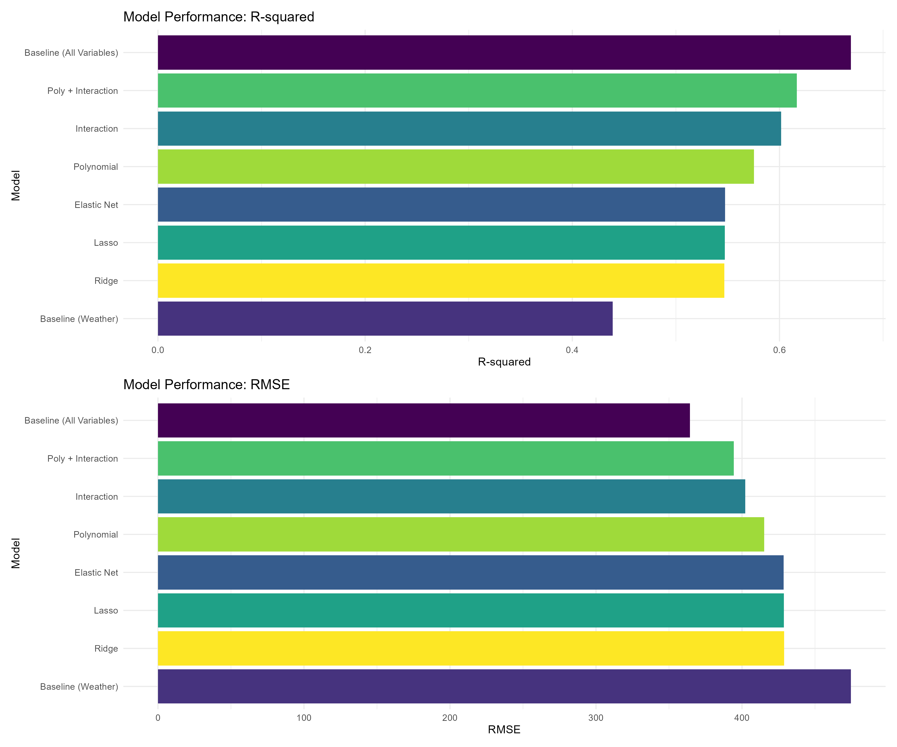
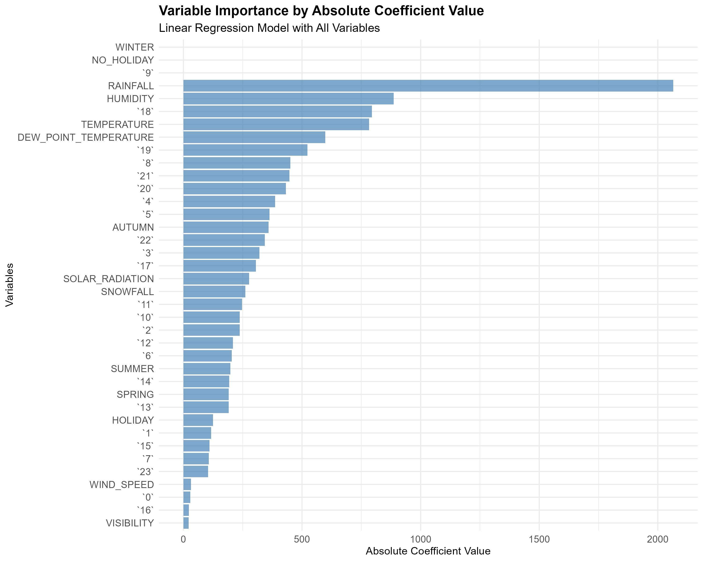

```{r setup, include=FALSE}
knitr::opts_chunk$set(
  echo=FALSE, warning=FALSE, message=FALSE,
  fig.align='center',
  out.width='0.85\\linewidth'
)
library(knitr)
library(ggplot2)
library(dplyr)
library(scales)
library(glue)
```

## Executive Summary

- Objective: build a robust, reproducible workflow to assess bike-sharing demand across cities, leveraging weather forecasts and historical usage.
- Approach: collect data (OpenWeather + public datasets), clean and integrate; perform EDA (SQL + visual); train and refine linear models; deliver an interactive Shiny dashboard.
- Results: best regression model achieves strong fit with interpretable coefficients; dashboard provides real‑time insights and forecast‑driven demand estimates.
- Impact: enables operations teams to anticipate demand swings, optimize bike availability, and plan maintenance windows.

## Introduction

- Motivation: weather significantly influences bike demand (temperature, humidity, wind, precipitation).
- Data sources: OpenWeather API, global cities metadata, recorded bike usage (Seoul + systems overview).
- Tools: R (tidyverse, modeling, Shiny), SQL for EDA, and reproducible reporting.

## Methodology Overview

- Data collection: scripted downloads and API calls; tracked outputs under `project5-capstone/output/`.
- Cleaning & integration: consistent types, missing values handled, feature engineering for model inputs.
- Modeling: baseline linear models → refined models; diagnostics and model comparison to select the best.
- Visualization & reporting: ggplot2 for EDA; beamer PDF for submission; Shiny for interactive exploration.

## EDA with SQL

- Used SQLite queries to explore distributions, correlations, and station-level patterns.
- Example pattern: identify top cities/days by predicted demand and weather conditions.

```sql
-- Example SQL snippet used during EDA (illustrative)
SELECT city, date, AVG(temperature) AS avg_temp, AVG(humidity) AS avg_hum
FROM weather_by_city
GROUP BY city, date
HAVING COUNT(*) > 12
ORDER BY avg_temp DESC
LIMIT 10;
```

## EDA with Visualization

```{r fig.show='hold'}


```

```{r fig.show='hold', out.width='0.48\\linewidth'}


```

## Predictive Analysis: Model Comparison

```{r out.width='0.75\\linewidth'}

```

## Predictive Analysis: Diagnostics & Coefficients

```{r fig.show='hold', out.width='0.48\\linewidth'}
knitr::include_graphics('../../project5-capstone/m04/diagnostic_plots_best_model.png')

```

## Shiny Dashboard (Module 5)

- Interactive map with city markers and popups.
- City selector drives trend plots for temperature and demand prediction.
- Clickable prediction trend returns point-level details.

```{r out.width='0.8\\linewidth'}
# Using one of the captured screenshots from m05
knitr::include_graphics('../../project5-capstone/m05/screenshots/Clipboard Image.jpg')
```

## Conclusions

- Weather signals are strong predictors of bike demand; temperature and humidity dominate.
- The refined linear model offers interpretable insights with actionable coefficients.
- The Shiny dashboard operationalizes predictions and supports real‑time decision‑making.
- Future work: add seasonality, holiday effects, and ML models (e.g., GBMs).

## Appendix: R Code Snippet

```{r}
code_path <- '../../project5-capstone/m04/refined_linear_models.R'
snippet <- tryCatch(readLines(code_path, n=80), error = function(e) 'Code unavailable')
cat(paste(snippet, collapse='\n'))
```

## Appendix: Additional Figures (Optional)

```{r fig.show='hold', out.width='0.32\\linewidth'}


```