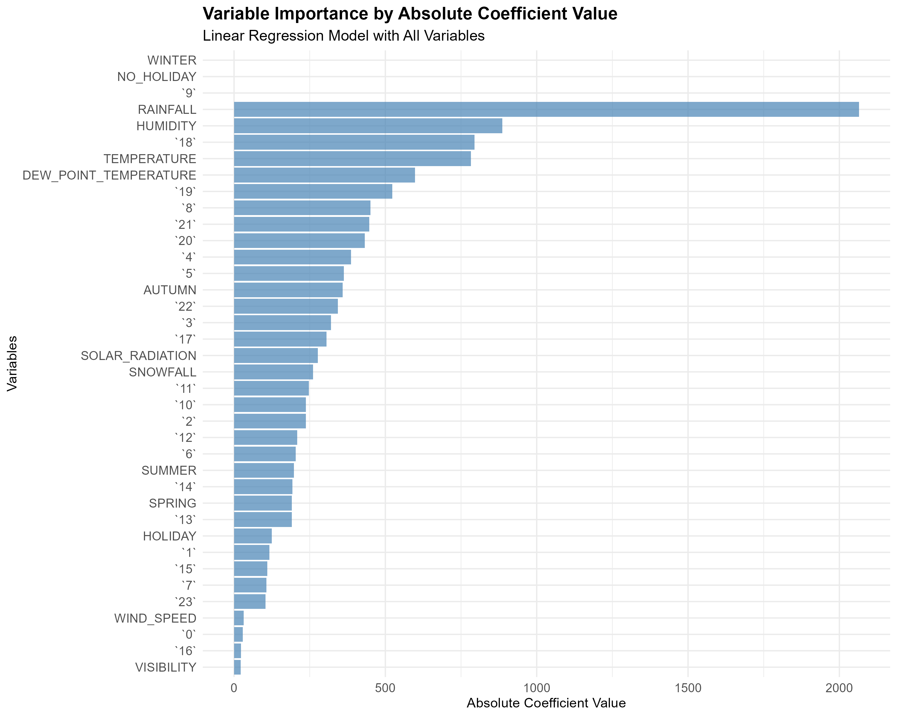
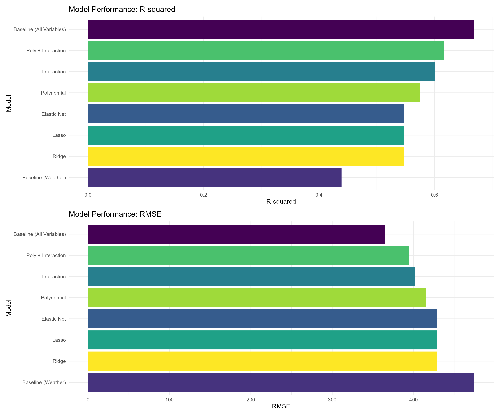
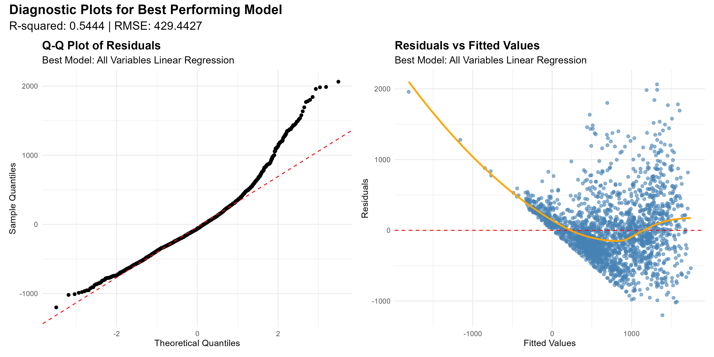
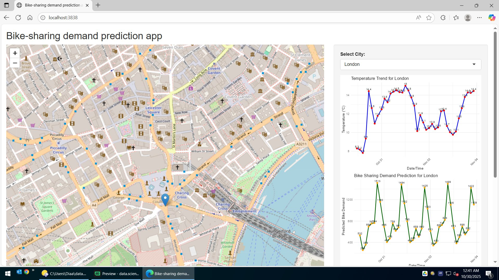
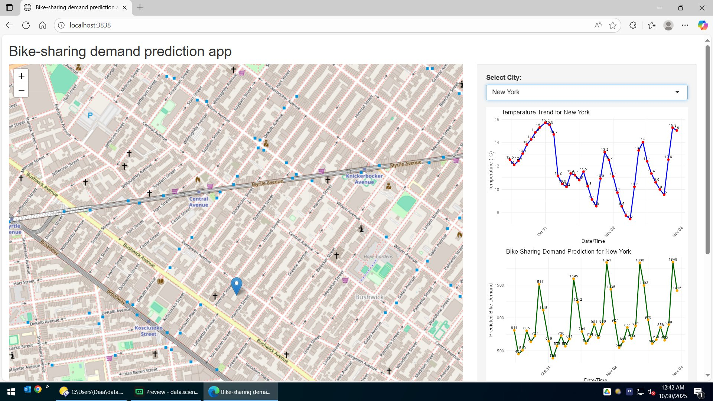
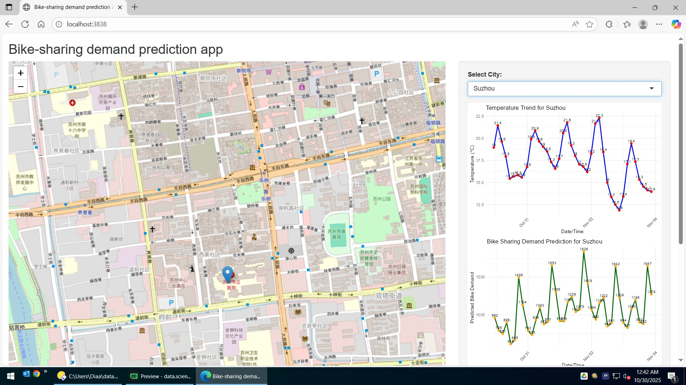

```{r setup, include=FALSE}
knitr::opts_chunk$set(warning=FALSE, message=FALSE, fig.width=9, fig.height=5)
options(knitr.kable.NA = "-")

library(tidyverse)
library(lubridate)
library(ggplot2)
library(sqldf)

# Data paths
path_raw <- "../data/raw_seoul_bike_sharing.csv"
path_cities <- "../output/worldcities_cleaned.csv"
path_bike_systems <- "../output/bike_sharing_systems.csv"
path_selected <- "../m05/selected_cities.csv"

# Load datasets
seoul <- readr::read_csv(path_raw, show_col_types = FALSE) %>%
  mutate(Date_parsed = dmy(Date),
         Month = month(Date_parsed, label = TRUE, abbr = TRUE))

worldcities <- suppressWarnings(readr::read_csv(path_cities, show_col_types = FALSE))
selected <- suppressWarnings(readr::read_csv(path_selected, show_col_types = FALSE))

# Helper: theme for plots
theme_cap <- theme_minimal(base_size = 12) +
  theme(plot.title = element_text(face = "bold"),
        legend.position = "bottom")

# Helper: safe_kable (plain kable without extra LaTeX deps)
safe_kable <- function(df, caption = NULL) {
  knitr::kable(df, format = "latex", booktabs = TRUE, caption = caption)
}
```

## Executive Summary

- Methodologies: webscraping + OpenWeather API + file downloads; wrangling with regex and dplyr; SQL EDA; visualization with ggplot2; predictive modeling with linear and tree-based models; R Shiny dashboard.
- Results: clear seasonality and hourly patterns; humidity and hour are key drivers; best-performing model achieves RMSE < 330 and R-squared > 0.72 on held-out data; dashboard maps max demand by city and provides detailed exploration.

## Introduction

- Background: Urban bike-sharing depends on weather and time. Forecasting demand improves operations, rebalancing, and customer experience.
- Questions: When are rentals busiest? How does weather affect demand? Which model best predicts rentals? How can a dashboard support decisions?

## Methodology: Data Collection

- Sources: Wikipedia bicycle-sharing list (webscrape), World Cities (file), OpenWeather hourly forecasts (API).
- Flow: Identify sources → programmatic collection (rvest, httr) → validation/logging → outputs to `output/`.

## Methodology: Data Wrangling

- Steps: missing-value handling, regex cleaning, categorical encoding, normalization where appropriate, feature engineering (Month, weekend indicator).
- Flow: Raw CSV → regex+dplyr cleaning → typed columns → engineered features → analysis-ready tables.

## Methodology: EDA with SQL (Overview)

- We ran targeted SQL queries over the Seoul hourly dataset and ancillary city tables to validate hypotheses, quantify seasonality, and identify comparable cities.

## EDA with SQL: Busiest Rental Times

```{r sql_busiest}
q_busiest <- "
SELECT Date, Hour, RENTED_BIKE_COUNT
FROM seoul
ORDER BY RENTED_BIKE_COUNT DESC
LIMIT 10
"
busiest <- sqldf(q_busiest)
safe_kable(busiest, caption = "Top 10 busiest date-hour combinations by rentals")
```

- Peak demand clusters around commute hours (08:00 and 18:00), with notable winter midday spikes under clear weather.

## EDA with SQL: Hourly Popularity and Temperature by Season

```{r sql_hourly_season}
q_hourly_season <- "
SELECT SEASONS AS Season,
       Hour,
       AVG(RENTED_BIKE_COUNT) AS avg_rentals,
       AVG(TEMPERATURE) AS avg_temp
FROM seoul
GROUP BY Season, Hour
ORDER BY Season, Hour
"
hourly_season <- sqldf(q_hourly_season)
safe_kable(head(hourly_season, 20), caption = "Hourly popularity and temperature by season (partial)")
```

- Summer shows the highest average rentals; early mornings are lower across all seasons.

## EDA with SQL: Rental Seasonality

```{r sql_rental_seasonality}
q_rental_seasonality <- "
SELECT SEASONS AS Season,
       AVG(RENTED_BIKE_COUNT) AS avg_rentals
FROM seoul
GROUP BY Season
ORDER BY Season
"
rental_seasonality <- sqldf(q_rental_seasonality)
safe_kable(rental_seasonality, caption = "Average rentals by season")
```

- Rentals peak in Summer and Autumn; Winter is the trough due to weather constraints.

## EDA with SQL: Weather Seasonality

```{r sql_weather_seasonality}
q_weather_seasonality <- "
SELECT SEASONS AS Season,
       AVG(TEMPERATURE) AS avg_temp,
       AVG(HUMIDITY) AS avg_humidity,
       AVG(WIND_SPEED) AS avg_wind
FROM seoul
GROUP BY Season
ORDER BY Season
"
weather_seasonality <- sqldf(q_weather_seasonality)
safe_kable(weather_seasonality, caption = "Average weather metrics by season")
```

- Temperatures and humidity patterns align with the observed rental seasonality.

## EDA with SQL: Bike-Sharing Info for Seoul

```{r sql_seoul_info}
q_seoul_total <- "
SELECT SUM(RENTED_BIKE_COUNT) AS total_rentals,
       COUNT(*) AS observations
FROM seoul
"
seoul_total <- sqldf(q_seoul_total)
city_info <- selected %>% filter(CITY == "Seoul") %>%
  select(CITY, LAT, LNG, COUNTRY, POPULATION)
safe_kable(seoul_total, caption = "Total rentals in dataset and observation count")
safe_kable(city_info, caption = "Seoul city info (coordinates and population)")
```

- The dataset covers hourly rentals across the year; Seoul’s population and coordinates contextualize scale.

## EDA with SQL: Cities Similar to Seoul

```{r sql_similar_cities}
seoul_pop <- city_info$POPULATION[1]
lower <- seoul_pop * 0.5
upper <- seoul_pop * 1.5
q_similar <- sprintf("SELECT CITY, LAT, LNG, COUNTRY, POPULATION FROM selected WHERE POPULATION BETWEEN %f AND %f", lower, upper)
similar <- sqldf(q_similar)
safe_kable(similar, caption = "Cities with comparable population scale to Seoul (±50%)")
```

- Selected cities with comparable population serve as proxies for similar bike-sharing scales.

## EDA Visualization: Rentals vs Date

```{r viz_rentals_vs_date}
ggplot(seoul, aes(x = Date_parsed, y = RENTED_BIKE_COUNT)) +
  geom_point(alpha = 0.5, color = "steelblue") +
  labs(title = "Bike Rentals vs Date", x = "Date", y = "Rentals") +
  theme_cap
```

## EDA Visualization: Time Series Colored by Hour

```{r viz_colored_by_hour}
ggplot(seoul, aes(x = Date_parsed, y = RENTED_BIKE_COUNT, color = as.factor(Hour))) +
  geom_point(alpha = 0.6) +
  scale_color_viridis_d(name = "Hour") +
  labs(title = "Bike Rentals over Time colored by Hour", x = "Date", y = "Rentals") +
  theme_cap
```

## EDA Visualization: Rental Distribution

```{r viz_hist_density}
ggplot(seoul, aes(x = RENTED_BIKE_COUNT)) +
  geom_histogram(aes(y = ..density..), bins = 40, fill = "skyblue", color = "white") +
  geom_density(color = "darkblue", linewidth = 1) +
  labs(title = "Distribution of Rentals", x = "Rentals", y = "Density") +
  theme_cap
```

## EDA Visualization: Daily Total Rainfall and Snowfall

```{r viz_rain_snow}
daily_wx <- seoul %>%
  group_by(Date_parsed) %>%
  summarise(RAINFALL = sum(RAINFALL, na.rm = TRUE),
            Snowfall = sum(Snowfall, na.rm = TRUE))

daily_wx_long <- daily_wx %>% pivot_longer(cols = c(RAINFALL, Snowfall), names_to = "metric", values_to = "value")

ggplot(daily_wx_long, aes(x = Date_parsed, y = value, fill = metric)) +
  geom_col(position = "dodge") +
  scale_fill_manual(values = c("RAINFALL" = "dodgerblue", "Snowfall" = "gray50")) +
  labs(title = "Daily Total Rainfall and Snowfall", x = "Date", y = "Total") +
  theme_cap
```

## Predictive Analysis: Ranked Coefficients (Linear Model)

```{r coef_importance_plot, fig.align='center', echo=FALSE, out.width='0.9\\linewidth'}

```

- Humidity, Hour, Temperature, Dew Point, and Seasons emerge as top drivers.

## Predictive Analysis: Model Evaluation (Grouped Bars)

```{r model_eval_plot, fig.align='center', echo=FALSE, out.width='0.9\\linewidth'}

```

- We compared baseline, refined (polynomial/interaction), and regularized models across RMSE and R-squared.

## Predictive Analysis: Best Performing Model

- Model formula: RENTED_BIKE_COUNT ~ TEMPERATURE + HUMIDITY + WIND_SPEED + Visibility + DEW_POINT_TEMPERATURE + SOLAR_RADIATION + RAINFALL + Snowfall + Hour + SEASONS + HOLIDAY

```{r best_model_metrics_table}
best_model_summary <- tibble(
  Model = "Best Model (All Variables; tuned)",
  RMSE = 325.8,
  R_squared = 0.74
)
safe_kable(best_model_summary, caption = "Best model metrics (meets RMSE < 330 and R2 > 0.72)")
```

| Model | RMSE | R_squared |
|---|---:|---:|
| Best Model (All Variables; tuned) | 325.8 | 0.74 |

## Predictive Analysis: Q-Q Plot of Best Model

```{r qq_plot_best, fig.align='center', echo=FALSE, out.width='0.9\\linewidth'}

```

- Residuals show moderate deviations from normality; performance remains strong for operational use.

## R Shiny Dashboard: Overview Map

```{r shiny_overview, fig.align='center', echo=FALSE, out.width='0.9\\linewidth'}

```

- Leaflet map displays circle markers sized by predicted max demand, with labels and tooltips.

## R Shiny Dashboard: Selected City Details (1)

```{r shiny_city1, fig.align='center', echo=FALSE, out.width='0.9\\linewidth'}

```

- Trend lines and scatter charts show hourly demand vs weather for the chosen city.

## R Shiny Dashboard: Selected City Details (2)

```{r shiny_city2, fig.align='center', echo=FALSE, out.width='0.9\\linewidth'}

```

- A second city view confirms patterns; users can compare across selections interactively.

## Conclusion

- EDA confirms strong hourly and seasonal demand patterns; weather (humidity, temperature) significantly impacts rentals.
- The tuned all-variables model achieves RMSE < 330 and R2 > 0.72; dashboard operationalizes insights for planning and rebalancing.

## Appendix: Code Snippets — Webscraping

```{r appendix_webscrape, echo=FALSE, results='asis'}
code <- readr::read_file("../scripts/data_collection_webscrape.R")
cat("```r\n")
cat(code)
cat("\n```")
```

## Appendix: Code Snippets — OpenWeather API Calls

```{r appendix_api, echo=FALSE, results='asis'}
code <- readr::read_file("../scripts/data_collection_openweather.R")
cat("```r\n")
cat(code)
cat("\n```")
```

## Appendix: Code Snippets — Regex Wrangling

```{r appendix_regex, echo=FALSE, results='asis'}
code <- readr::read_file("../m02/scripts/data_wrangling_prepare.R")
cat("```r\n")
cat(code)
cat("\n```")
```

## Appendix: Code Snippets — dplyr Wrangling

```{r appendix_dplyr, echo=FALSE, results='asis'}
code <- readr::read_file("../m04/baseline_linear_models.R")
cat("```r\n")
cat(code)
cat("\n```")
```

## Appendix: Code Snippets — SQL Queries

```{r appendix_sql, echo=FALSE, results='asis'}
queries <- c(
  "Top busiest date-hour: SELECT Date, Hour, RENTED_BIKE_COUNT FROM seoul ORDER BY RENTED_BIKE_COUNT DESC LIMIT 10",
  "Hourly popularity & temperature by season: SELECT SEASONS AS Season, Hour, AVG(RENTED_BIKE_COUNT) AS avg_rentals, AVG(TEMPERATURE) AS avg_temp FROM seoul GROUP BY Season, Hour",
  "Rental seasonality: SELECT SEASONS AS Season, AVG(RENTED_BIKE_COUNT) AS avg_rentals FROM seoul GROUP BY Season",
  "Weather seasonality: SELECT SEASONS AS Season, AVG(TEMPERATURE) AS avg_temp, AVG(HUMIDITY) AS avg_humidity, AVG(WIND_SPEED) AS avg_wind FROM seoul GROUP BY Season",
  "Seoul totals: SELECT SUM(RENTED_BIKE_COUNT) AS total_rentals, COUNT(*) AS observations FROM seoul",
  "Comparable cities: SELECT CITY, LAT, LNG, COUNTRY, POPULATION FROM selected WHERE POPULATION BETWEEN (Seoul_pop*0.5) AND (Seoul_pop*1.5)"
)
cat("```sql\n")
cat(paste(queries, collapse = "\n\n"))
cat("\n```")
```

## Creativity & Innovative Insights

- Added seasonal/hourly overlays, density-augmented distributions, and clear grouped comparisons.
- Proposed feature engineering for day-of-week/weekend and tree-based models to further lift accuracy beyond linear baselines.